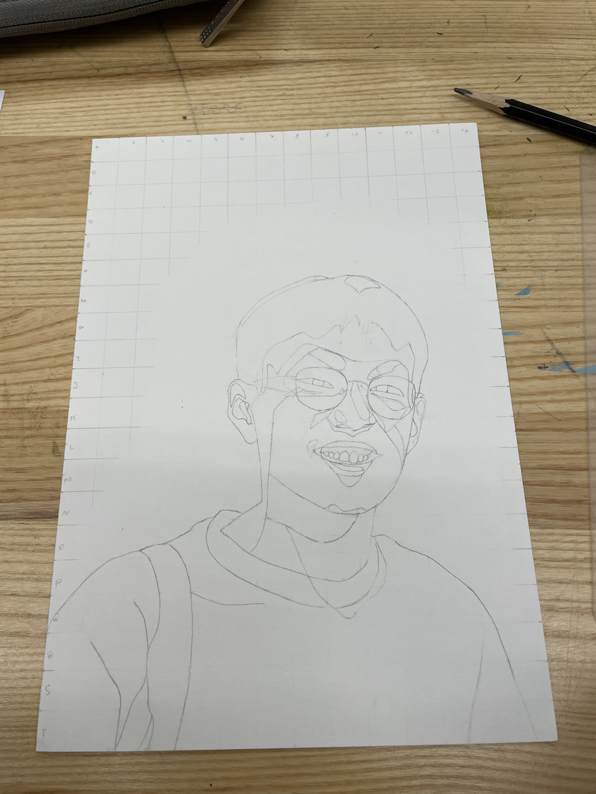
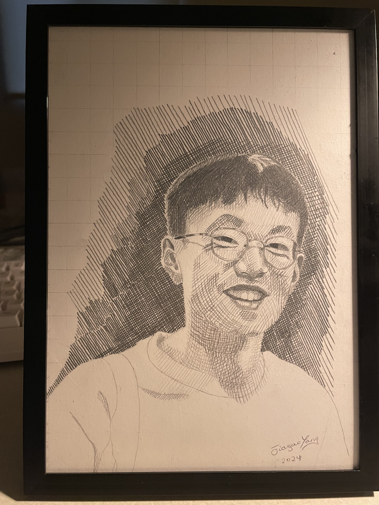
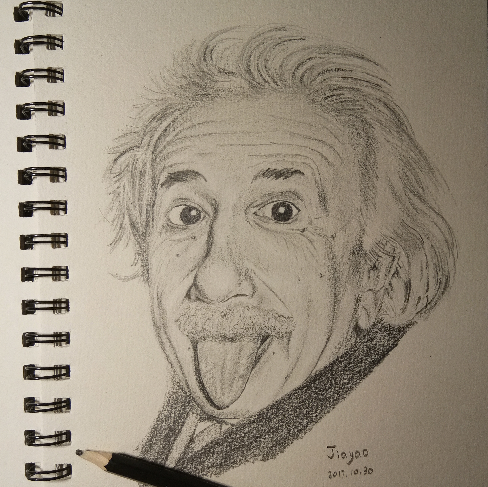
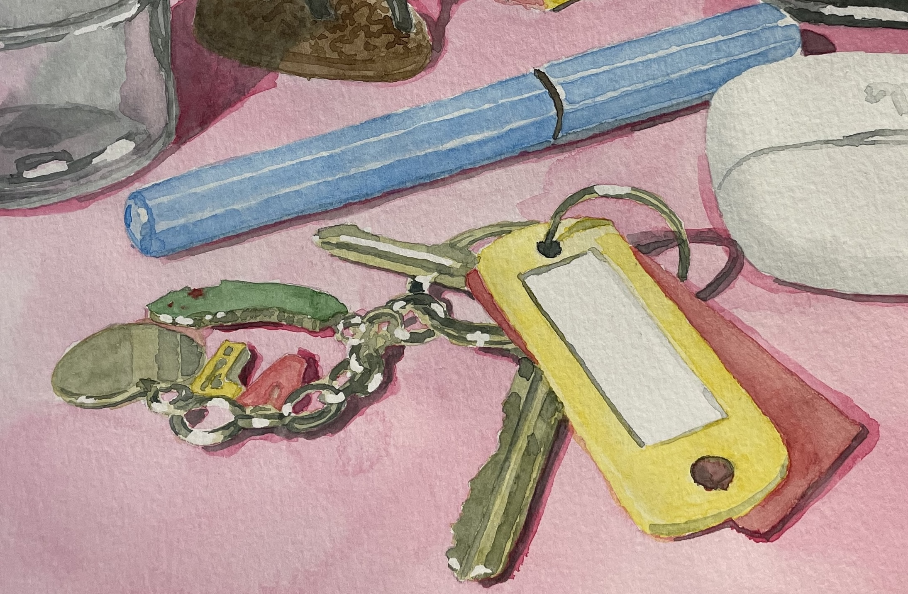
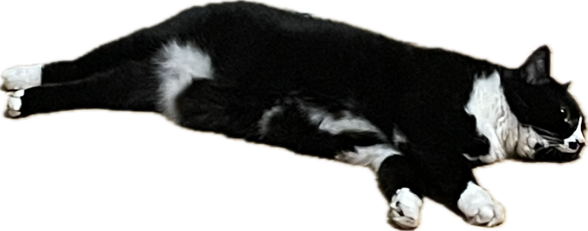

I enjoy drawing and painting. One of the important things I've learned from drawing is *being patient* and appreciating everything around me. 

  <small>A self-portrait from my drawing class.</small>

 <small>One of my favorite scientists.</small>

I'm also learning watercolor painting, which taught me to be brave and to allow things to develop in their own way. 

Below is also one of my favorite scientists who has great passion and curiosity

