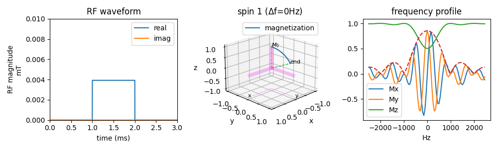
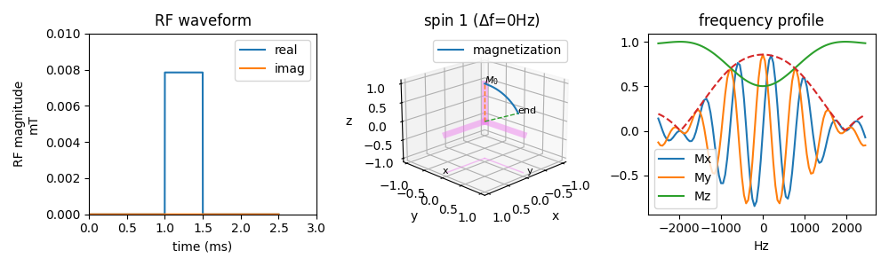
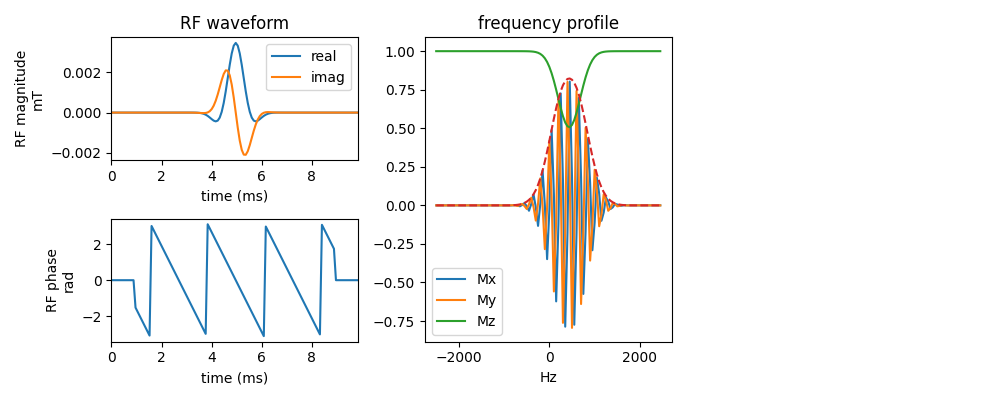
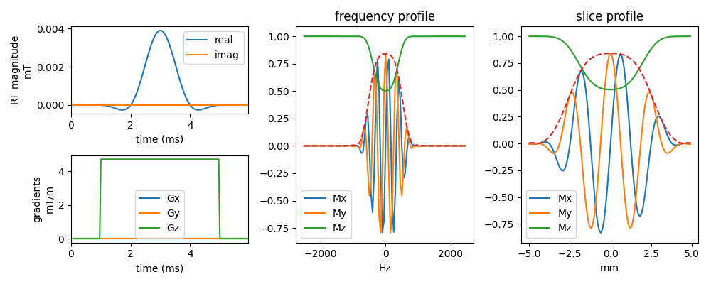

## Basics and characteristics of MRI pulses
The behavior of the magnetization is described by the Bloch equation (the relaxation is ignored here)

$$\text{Bloch equation}:\quad \frac{d\mathbf{M}}{dt} = \mathbf{M} \times \gamma \mathbf{B}$$

$$\mathbf{M}:\text{magnetization}, \gamma: \text{gyromagnetic ratio}, \mathbf{B}: \text{magnetic field}$$

## Examples

### Rectangular pulse
The flip angle from a rectangular pulse can be computed using 
$$\theta = \gamma B_1 T$$
The square pulse is nonselective, but in frequency, it does have a bandwidth for different pulse duration,

### Gaussian pulse

### SINC 
It is often mupltiplied by a window function. It can be used to select a slice with slice selective gradient. 
Things to control a sinc pulse
- time-bandwidth product, pulse duration (then the bandwidth can be computed)
- slice thickness (then the slice gradient can be determined)

### SLR
Shinnar-Le Roux pulse[^slrpulse]. 

[^slrpulse]: Pauly, John, et al. "Parameter relations for the Shinnar-Le Roux selective excitation pulse design algorithm (NMR imaging)." IEEE transactions on medical imaging 10.1 (1991): 53-65.

### Optimal control design

