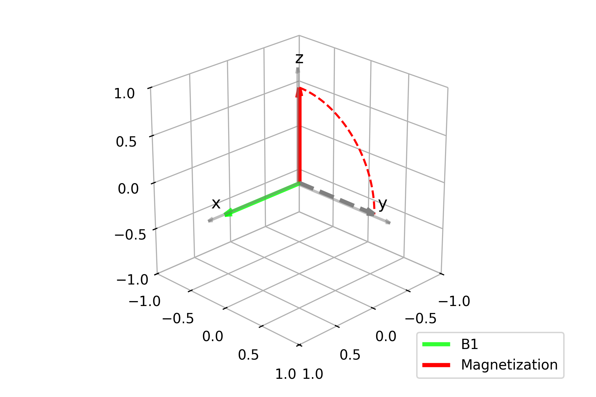
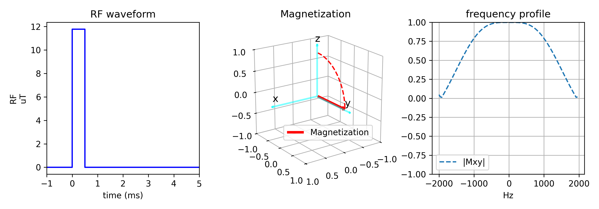
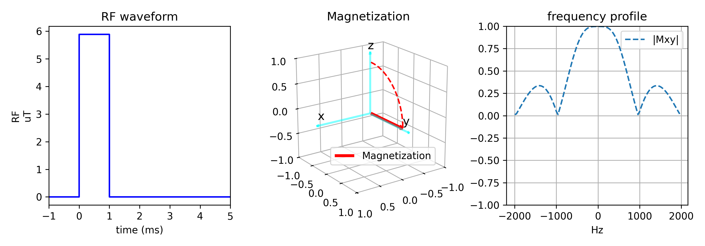
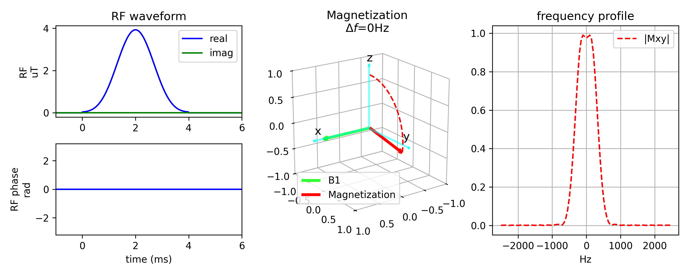
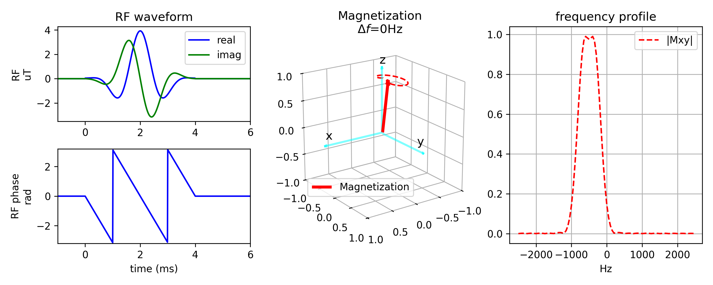
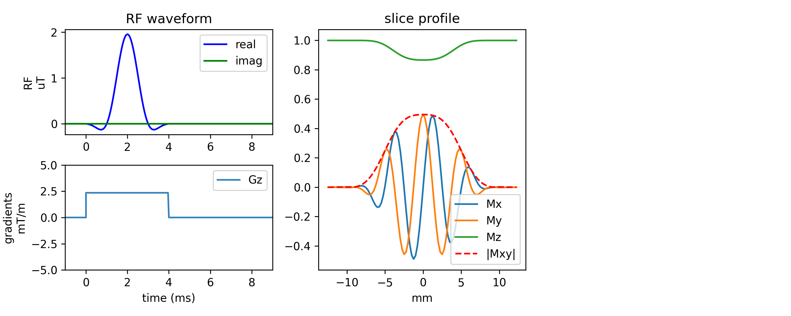
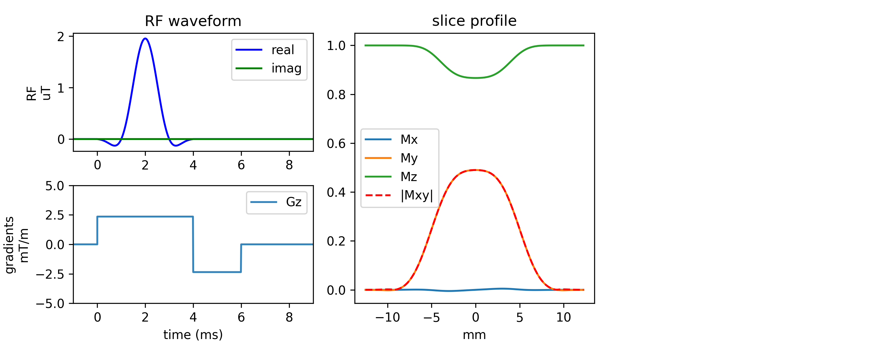

<!-- ## Basics and characteristics of MRI pulses -->
From a macroscopic perspective, the net magnetization vector precesses at the Larmor frequency,  

$$\omega_0=\gamma B_0.$$

Often the rotating frame is considered for simplifying the analysis. 
The behavior or dynamics of the magnetization is described by the Bloch equation

$$\frac{d\mathbf{M}}{dt} = \mathbf{M} \times \gamma \mathbf{B}$$

where the relaxation is ignored, $$\mathbf{M}$$ is magnetization, $$\gamma$$ is gyromagnetic ratio, and $$\mathbf{B}$$ is magnetic field or effective magnetic field. 

The magnetization $$\mathbf{M}$$ is considered to be aligned with the z-direction (main field direction) in equilibrium state. 
When a very short pulse is applied in the transverse plane, the magnetization will be flipped towards the transverse plane.

In practice, all the pulses have certain durations, i.e., the rectangular pulse. 

**Rectangular pulse**  
The flip angle from a rectangular pulse can be computed using 
$$\theta = \gamma B_1 T.$$
The square pulse is nonselective ideally, 
but it does have a bandwidth in frequency because it is not infinitely short in practice. 

Not everything is "on resonance", but the voxel with better matched resonance frequency as the RF pulse gets more influence from the applied pulse. 
So two basic characteristics of the RF pulse are **duration** and **bandwidth**. 

**Gaussian pulse**  
Gaussian pulse has a Gaussian shape RF envolope and also a Gaussian shape frequency band. 
For example, Gaussian pulse can be used for fat signal saturation by shifting its center frequency. 

**SINC pulse**  
The off-resonance is not always something we want to avoid; it can be used to create selective RF excitation. 
SINC pulse combined with a slice selective gradient can be used to excite the signal of a certain slice. It is often mupltiplied by a window function (apodization). 
Things to control a sinc pulse: 
1) time-bandwidth product, pulse duration (then the bandwidth can be computed) 
2) slice thickness (then the slice gradient can be determined).

One way to analyze the excitation profile of the pulse is **small-tip-angle analysis**[^smalltipangle]. 
Assume the flip angle small, which also means $$dM_z/dt \approx 0,$$ 
then the Bloch equation can be simplified as 

$$\frac{d \mathbf{M}}{dt} = 
\begin{bmatrix}0 & \Delta \omega & 0 \\ -\Delta\omega & 0 & \gamma B_1(t) \\ 0 & { 0} & 0\end{bmatrix} 
\begin{bmatrix} M_x \\ M_y \\ M_z \end{bmatrix},$$

where $$\Delta\omega$$ is the off-resonance. This gives the result 

$$M_{xy}(t) = i M_0 e^{-i\omega t} \int_0^t e^{i\omega s} \gamma B_1(t) ds.$$

which indicates the excitated transverse magnetization is related to the frequency spectrum of the RF profile $$B_1(t).$$
The small-tip-angle approximation also introduces the concept of excitation k-space. 

While, it always needs an rephasing gradient to refocus the magnetization within the excited slice. 
The need for rephasing gradient can also be understood using the excitation k-space. 

[^smalltipangle]: Pauly, John, Dwight Nishimura, and Albert Macovski. "A k-space analysis of small-tip-angle excitation." Journal of Magnetic Resonance (1969) 81.1 (1989): 43-56.

**Shinnar-Le Roux pulse**  
SLR pulse[^slrpulse] produce more desired excitation profile compared to the SINC pulse when the large-flip angle is required. 
The analysis of the SLR pulse design uses the spin-domain representation, which represents the rotation by $$(\alpha,\beta)$$

$$\begin{aligned}\alpha = \cos \phi/2 - i n_{z}\sin\phi/2, \\ 
\beta = - i (n_{x} + i n_{y}) \sin \phi/2, \end{aligned}$$

where $$(n_x,n_y,n_z)$$ is the rotation axis and $$\phi$$ is the rotation angle. 
And SLR translates the pulse design problems as digital filter design problems. 

[^slrpulse]: Pauly, John, et al. "Parameter relations for the Shinnar-Le Roux selective excitation pulse design algorithm (NMR imaging)." IEEE transactions on medical imaging 10.1 (1991): 53-65.

**Multidimensional excitation pulse**  
Using the concept of excitation k-space, 2D and 3D spatially selective pulse can be designed. 

**Spatial-Spectral pulse** 

**Adibatic pulse**  
...

reference: [^principlesOfMRI] 

[^principlesOfMRI]: Nishimura, D. (1996). Principles of magnetic resonance imaging: Dwight d. Nishimura.

---

_Reference_

