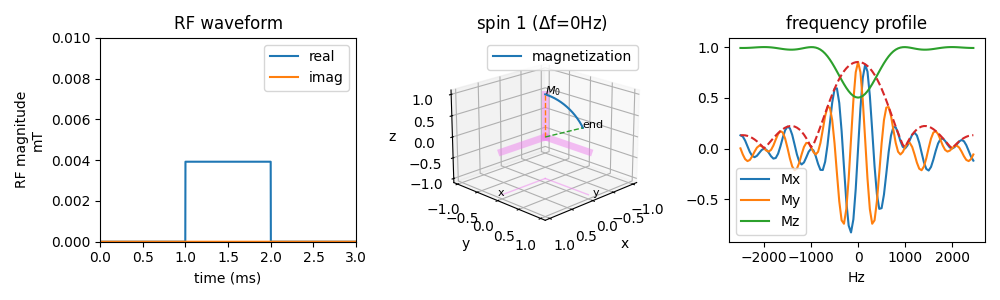
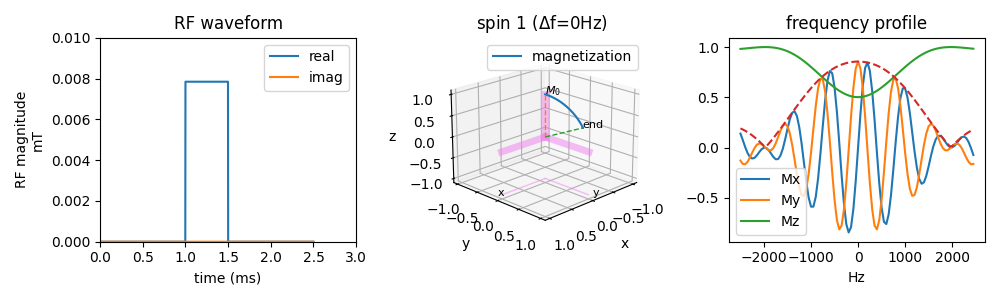
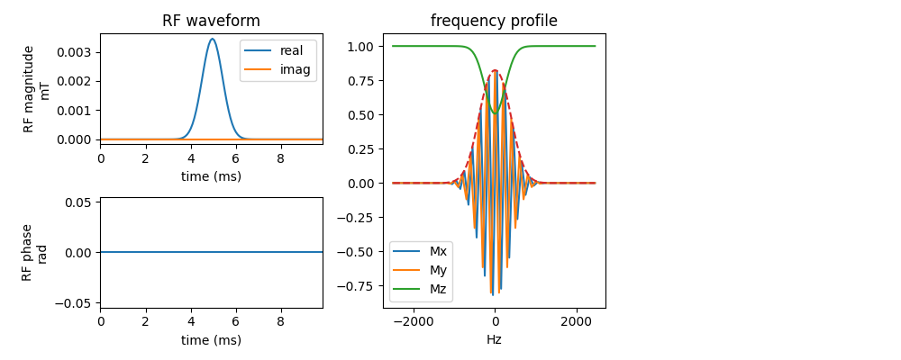
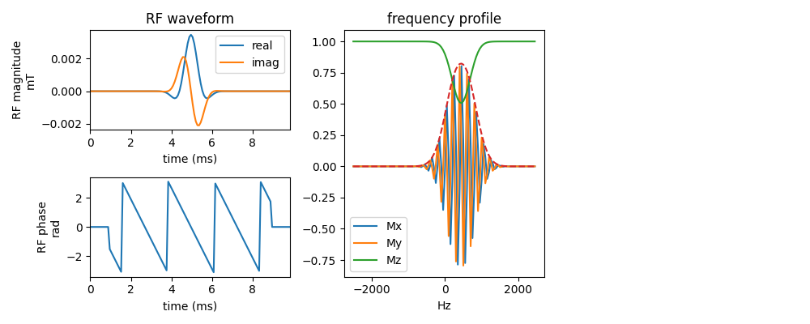
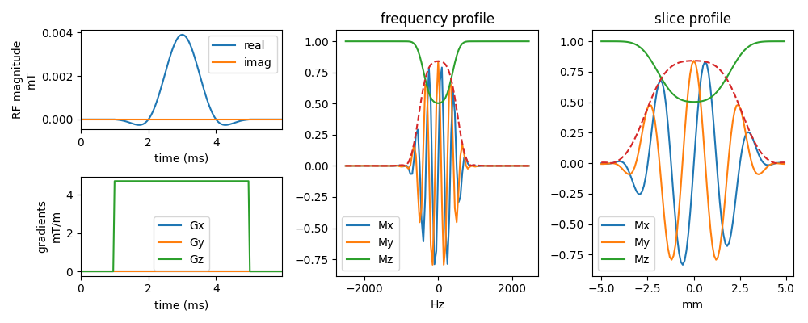
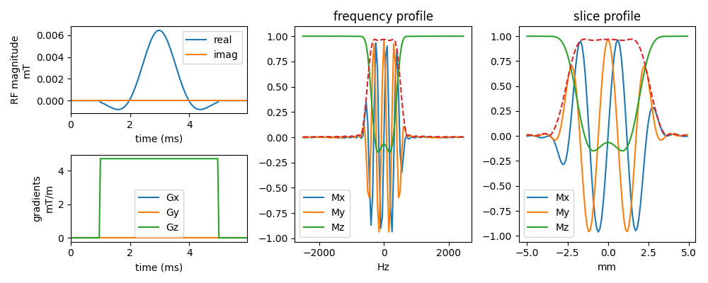

<!-- ## Basics and characteristics of MRI pulses -->
From a macroscopic perspective, the net magnetization vector precesses at the Larmor frequency,  
$$\omega_0=\gamma B_0.$$
Often the rotating frame is considered for simplifying the analysis. 
The behavior or dynamics of the magnetization is described by the Bloch equation

$$\text{Bloch equation}:\quad \frac{d\mathbf{M}}{dt} = \mathbf{M} \times \gamma \mathbf{B}$$

where the relaxation is ignored, $$\mathbf{M}$$ is magnetization, $$\gamma$$ is gyromagnetic ratio, and $$\mathbf{B}$$ is magnetic field or effective magnetic field. 

The magnetization $$M$$ is considered to be aligned with the z-direction (main field direction) in equilibrium state. 
When a very short pulse is applied in the transverse plane, the magnetization will be flipped towards the transverse plane. 

In practice, all the pulses have certain durations, i.e., the rectangular pulse. 

<!--
### Rectangular pulse
The flip angle from a rectangular pulse can be computed using 
$$\theta = \gamma B_1 T.$$
The square pulse is nonselective, but in frequency, it does have a different bandwidth for a different pulse duration,

### Gaussian pulse

### SINC 
It is often mupltiplied by a window function. It can be used to select a slice with slice selective gradient. 
Things to control a sinc pulse
- time-bandwidth product, pulse duration (then the bandwidth can be computed)
- slice thickness (then the slice gradient can be determined)

### SLR
Shinnar-Le Roux pulse[^slrpulse]. 

[^slrpulse]: Pauly, John, et al. "Parameter relations for the Shinnar-Le Roux selective excitation pulse design algorithm (NMR imaging)." IEEE transactions on medical imaging 10.1 (1991): 53-65.

### Adibatic pulse

---

-->
