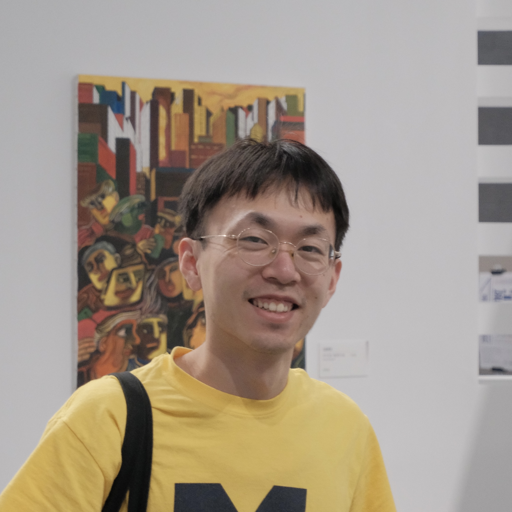

---
#
# By default, content added below the "---" mark will appear in the home page
# between the top bar and the list of recent posts.
# To change the home page layout, edit the _layouts/home.html file.
# See: https://jekyllrb.com/docs/themes/#overriding-theme-defaults
#
layout: home
---

<aside style="float:left;padding:10px;width:180px;background:;"></aside>

Hi! I'm Jiayao Yang.  Welcome to my personal website!

I'm a PhD candidate in the [Electrical Engineering and Computer Science](https://eecs.engin.umich.edu/) department at [University of Michgan - Ann Arbor](https://umich.edu/), majoring in Signal & Image Processing and Machine Learning. I'm fortunate to be co-advised by [Jon-Fredrik Nielsen](https://bme.umich.edu/people/jon-fredrik-nielsen/) and [Yun Jiang](https://medicine.umich.edu/dept/radiology/yun-jiang-phd). My research interests include magnetic resonance imaging (MRI), signal processing, numerical optimization, and machine learning.

<a href="https://scholar.google.com/citations?user=dDIuj7sAAAAJ">[Google Scholar]</a> <a href="https://github.com/jyang000">[GitHub]</a> <a href="https://www.linkedin.com/in/jiayao-yang-2235b4181">[LinkedIn]</a>

**News**
- **May 10-15, 2025**: I will present at [2025 ISMRM & ISMRT Annual Meeting & Exhibition](https://www.ismrm.org/25m/) in Hawaii! 
- **March 28-30, 2025**: I will present at [ISMRM Workshop on Body MRI](https://www.ismrm.org/workshops/2025/Body/) in Philadelphia!
- **February 16-20, 2025**: attended the [ISMRM Workshop on Diffusion MRI](https://www.ismrm.org/workshops/2025/Diffusion40/) in Japan
- **January, 2025**: abstract accepted by ISMRM Workshop on Body MRI and two abstracts accepted by 2025 ISMRM Annual Meeting
- **May 04-09, 2024**: presented at [2024 ISMRM & ISMRT Annual Meeting & Exhibition](https://www.ismrm.org/24m/) in Singapore
- **April, 2024**: achieved my PhD candidacy
- **March 28-29, 2024**: organized 2024 [Michigan Student Symposium for Interdisciplinary Statistical Sciences (MSSISS)](https://sites.lsa.umich.edu/mssiss/)
- **September, 2023**: started my PhD program in ECE at [University of Michigan](https://umich.edu/)
- **June 03-08, 2023**: presented at [2023 ISMRM & ISMRT Annual Meeting & Exhibition](https://www.ismrm.org/23m/) in Toronto
- **January 08-11, 2023**: presented at ISMRM workshop on [Data Sampling & Image Reconstruction](https://www.ismrm.org/workshops/2023/Data/) in Sedona

**Conference and presentations**
- **Jiayao Yang**, Jon-Fredrik Nielsen, Jeffrey A. Fessler, and Yun Jiang, “3D High-Resolution Reduced Field-of-View T2-Weighted Prostate Imaging by Combining 3D EPI & Spatially Selective Pulses”, digital poster in 2025 ISMRM Workshop on Body MRI: Unsolved Problems & Unmet Needs, Philadelphia, PA, USA
- **Jiayao Yang**, Jesus Ernesto Fajardo, Jeffrey A. Fessler, Vikas Gulani, Jon-Fredrik Nielsen, and Yun Jiang, “Calibration-free Multidimensional Universal Refocusing Pulse Design for 3D Reduced Field-of-View Prostate Imaging”, digital poster in 2024 ISMRM Annual Meeting, Singapore. (May 2024) (program number: 4094)
- Jesus Ernesto Fajardo, **Jiayao Yang**, Tejinder Kaur, Nicole Seiberlich, Vikas Gulani, Yun Jiang, "Accelerated MR Fingerprinting with 1 mm spatial resolution for prostate cancer at 3.0 T", 2024 ISMRM Annual Meeting, Singapore.
- **Jiayao Yang**, Jon-Fredrik Nielsen, and Yun Jiang, “Multidimensional RF pulse design in spin-domain using auto-differentiation for 3D refocusing pulse”, in-person oral Power Pitch presentation in 2023 ISMRM Annual Meeting, Toronto, ON, Canada. (June 2023) (program number: 0200)
- **Jiayao Yang**, Jon-Fredrik Nielsen, and Yun Jiang, “Multidimensional RF pulse design in spin-domain using auto-differentiation”, poster in 2023 ISMRM Workshop on Data Sampling & Image Reconstruction, Sedona, AZ, USA (Jan 2023) (poster number: 77)

**Posts**
- [More about me ...](files/aboutme.md)
- [some resources and notes of MRI](files/mri-notes.md)

*<small>last update: 03/08/2025</small>* 
[*<small>About this site</small>*](about.md)
