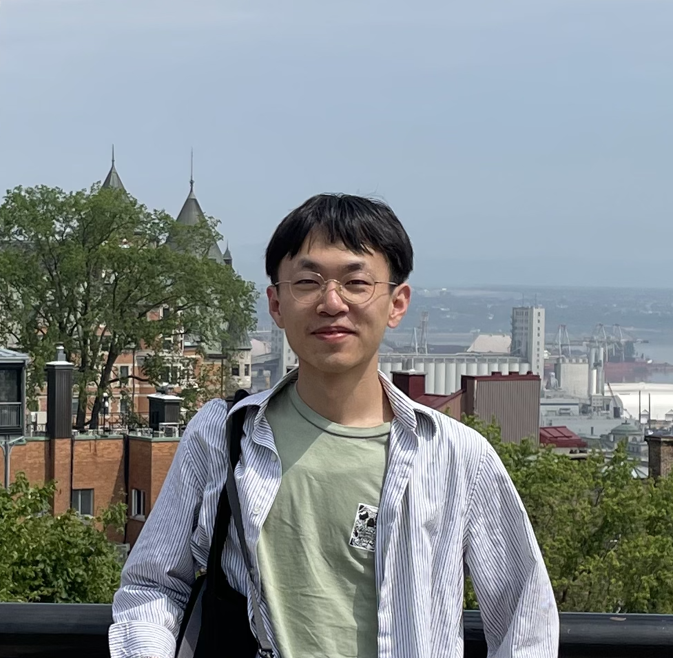

---
#
# By default, content added below the "---" mark will appear in the home page
# between the top bar and the list of recent posts.
# To change the home page layout, edit the _layouts/home.html file.
# See: https://jekyllrb.com/docs/themes/#overriding-theme-defaults
#
layout: home
---

<aside style="float:right;padding:10px;width:180px;background:;"></aside>

Hi, my name is Jiayao Yang.

I am a PhD student majoring in Signal & Image Processing and Machine Learning of EECS department in [University of Michgan - Ann Arbor](https://umich.edu/) co-advised by [Jon-Fredrik Nielsen](https://bme.umich.edu/people/jon-fredrik-nielsen/) and [Yun Jiang](https://medicine.umich.edu/dept/radiology/yun-jiang-phd). My research interests include magnetic resonance imaging (MRI), signal processing, optimization, and machine learning.

**News**
- **May 04-09, 2024**: presented at [2024 ISMRM & ISMRT Annual Meeting & Exhibition](https://www.ismrm.org/24m/) in Singapore
- **March 28-29, 2024**: organized [Michigan Student Symposium for Interdisciplinary Statistical Sciences (MSSISS)](https://sites.lsa.umich.edu/mssiss/)
- **Sepmtember, 2023**: started my PhD program at [University of Michigan](https://umich.edu/)
- **June 03-08, 2023**: presented at [2023 ISMRM & ISMRT Annual Meeting & Exhibition](https://www.ismrm.org/23m/) in Toronto
- **January 08-11, 2023**: presented at ISMRM workshop on [Data Sampling & Image Reconstruction](https://www.ismrm.org/workshops/2023/Data/) in Sedona

**Conference and presentations**
- Jiayao Yang, Jesus Ernesto Fajardo, Jeffrey A. Fessler, Vikas Gulani, Jon-Fredrik Nielsen, and Yun Jiang, “Calibration-free Multidimensional Universal Refocusing Pulse Design for 3D Reduced Field-of-View Prostate Imaging”, digital poster in 2024 ISMRM Annual Meeting, Singapore. (May 2024) (program number: 4094)
- Jiayao Yang, Jon-Fredrik Nielsen, and Yun Jiang, “Multidimensional RF pulse design in spin-domain using auto-differentiation for 3D refocusing pulse”, in-person oral Power Pitch presentation in 2023 ISMRM Annual Meeting, Toronto, ON, Canada. (June 2023) (program number: 0200)
- Jiayao Yang, Jon-Fredrik Nielsen, and Yun Jiang, “Multidimensional RF pulse design in spin-domain using auto-differentiation”, poster in 2023 ISMRM Workshop on Data Sampling & Image Reconstruction, Sedona, AZ, USA (Jan 2023) (poster number: 77)
