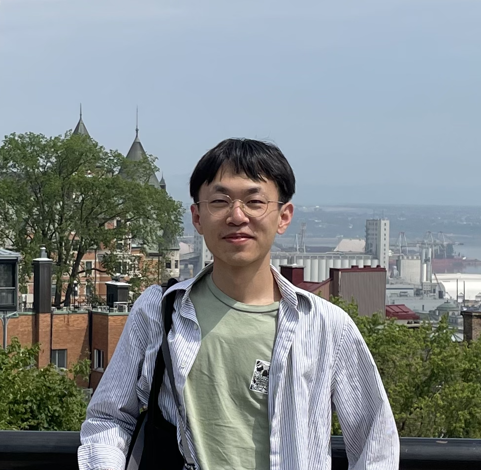

---
#
# By default, content added below the "---" mark will appear in the home page
# between the top bar and the list of recent posts.
# To change the home page layout, edit the _layouts/home.html file.
# See: https://jekyllrb.com/docs/themes/#overriding-theme-defaults
#
layout: home
---

<aside style="float:right;padding: 10px;border: 1px solid rgb(205,205,205);border-top: 6px solid rgb(205,205,205,0.8);width=180;background: "></aside>

Hi, my name is Jiayao Yang.

I am a PhD student majoring in Signal & Image Processing and Machine Learning of EECS department in University of Michgan - Ann Arbor co-advised by Jon-Fredrik Nielsen and Yun Jiang. My research interests include magnetic resonance imaging (MRI), signal processing, optimization, and machine learning.

**News**
- **May 04-09, 2024**: attended ISMRM 2024 Annual meeting in Singapore
- **Sepmtember, 2023**: started my PhD program at University of Michigan
