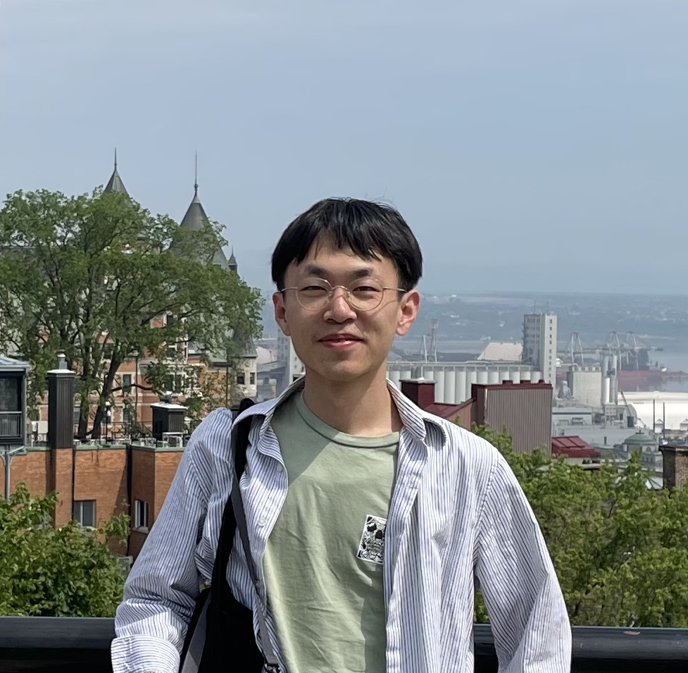

<ul style="text-align: center;background-color: #dcdcdc;">
	<li style="display: inline;"><a href="https://jyang000.github.io/" style="color:black;">HOME</a></li>
	<li style="display: inline;"><a href="https://jyang000.github.io/research.html" style="color:black;">RESEARCH</a></li>
	<li style="display: inline;"><a href="https://jyang000.github.io/blogs.html" style="color:black;">BLOGS</a></li>
</ul>
<aside style="float:right;padding: 10px;border: 1px solid rgb(205,205,205);border-top: 6px solid rgb(205,205,205,0.8);width=200;background: "></aside>
Hi, my name is Jiayao Yang.

I am a PhD student majoring in Signal & Image Processing and Machine Learning of EECS department in [University of Michgan - Ann Arbor](https://umich.edu) co-advised by [Jon-Fredrik Nielsen](https://bme.umich.edu/people/jon-fredrik-nielsen/) and [Yun Jiang](https://medicine.umich.edu/dept/radiology/yun-jiang-phd). My research interests include magnetic resonance imaging (MRI), signal processing, optimization, and machine learning.

Jiayao Yang
