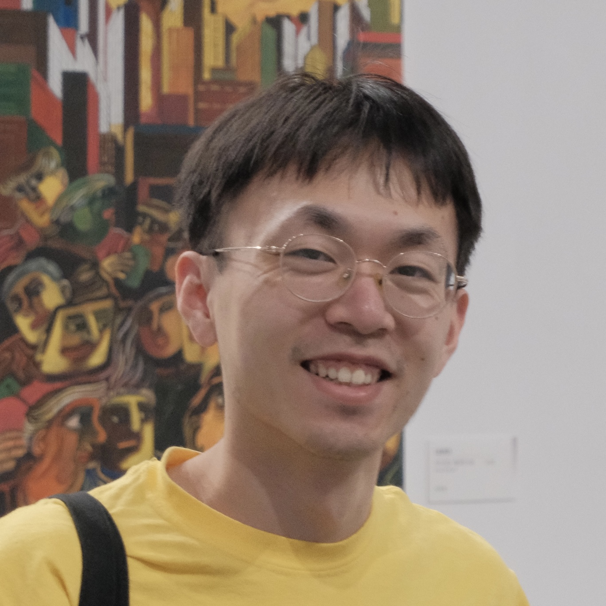

---
#
# By default, content added below the "---" mark will appear in the home page
# between the top bar and the list of recent posts.
# To change the home page layout, edit the _layouts/home.html file.
# See: https://jekyllrb.com/docs/themes/#overriding-theme-defaults
#
layout: home
---

<aside style="float:right;padding:10px;width:160px;background:;">

</aside>

Hi! I'm Jiayao Yang 

I'm a PhD candidate in the [Electrical Engineering and Computer Science](https://eecs.engin.umich.edu/) department at [University of Michgan - Ann Arbor](https://umich.edu/), majoring in Signal & Image Processing and Machine Learning. I'm fortunate to be co-advised by [Jon-Fredrik Nielsen](https://websites.umich.edu/~jfnielse/) and [Yun Jiang](https://medicine.umich.edu/dept/radiology/yun-jiang-phd). 
My current research explores new algorithms for multidimensional pulses design in magnetic resonance imaging (MRI) using optimization methods and their applications to reduced field-of-view imaging. I'm also interested in developing new algorithms for MRI combining signal processing knowledge and machine learning. 

**News**
- **May 9-14, 2026**, I gave an oral pitch at [2026 ISMRM & ISMRT Annual Meeting & Exhibition](https://www.ismrm.org/26m/) in Cape Town
- **Jan 11-14, 2026**, I presented in [ISMRM Workshop on Data Sampling and Image Reconstruction](https://echo.ismrm.org/program/SEDONA26) in Sedona
- **July 10-11, 2025**, I gave an oral presentation in [Magnetic Resonance in Madison](https://magresmadison.radiology.wisc.edu/abstract-submission/) conference 
- **June 16, 2025**: our paper on multidimensional RF pulse design using spin-domain optimization is published online! Check the paper [here](https://doi.org/10.1002/mrm.30607)!
- **May 10-15, 2025**: I presented at [2025 ISMRM & ISMRT Annual Meeting & Exhibition](https://www.ismrm.org/25m/) in Hawaii 
- **March 28-30, 2025**: I presented at [ISMRM Workshop on Body MRI](https://www.ismrm.org/workshops/2025/Body/) in Philadelphia
- **February 16-20, 2025**: I attended the [ISMRM Workshop on Diffusion MRI](https://www.ismrm.org/workshops/2025/Diffusion40/) in Japan
<!-- - **January, 2025**: one abstract accepted by ISMRM Workshop on Body MRI and two abstracts accepted by 2025 ISMRM Annual Meeting -->
<!-- - **May 04-09, 2024**: I presented at [2024 ISMRM & ISMRT Annual Meeting & Exhibition](https://www.ismrm.org/24m/) in Singapore -->
<!-- - **April, 2024**: I achieved my PhD candidacy -->
<!-- - **March 28-29, 2024**: we organized 2024 [Michigan Student Symposium for Interdisciplinary Statistical Sciences (MSSISS)](https://sites.lsa.umich.edu/mssiss/) -->
<!-- - **September, 2023**: I started my PhD program in ECE at [University of Michigan](https://umich.edu/) -->
<!-- - **June 03-08, 2023**: I presented at [2023 ISMRM & ISMRT Annual Meeting & Exhibition](https://www.ismrm.org/23m/) in Toronto -->
<!-- - **January 08-11, 2023**: I presented at ISMRM workshop on [Data Sampling & Image Reconstruction](https://www.ismrm.org/workshops/2023/Data/) in Sedona -->
