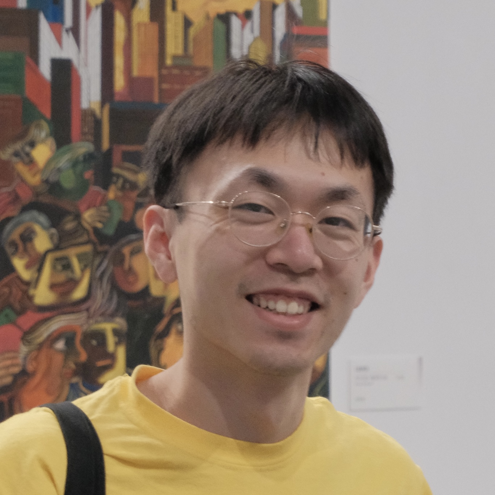

---
#
# By default, content added below the "---" mark will appear in the home page
# between the top bar and the list of recent posts.
# To change the home page layout, edit the _layouts/home.html file.
# See: https://jekyllrb.com/docs/themes/#overriding-theme-defaults
#
layout: home
---

<aside style="float:left;padding:10px;width:180px;background:;"></aside>

Hi! I'm Jiayao Yang.  Welcome to my personal website!

I'm a PhD candidate in the [Electrical Engineering and Computer Science](https://eecs.engin.umich.edu/) department at [University of Michgan - Ann Arbor](https://umich.edu/), majoring in Signal & Image Processing and Machine Learning. I'm fortunate to be co-advised by [Jon-Fredrik Nielsen](https://websites.umich.edu/~jfnielse/) and [Yun Jiang](https://medicine.umich.edu/dept/radiology/yun-jiang-phd). My current research explores new algorithms for multidimensional pulses design in magnetic resonance imaging (MRI) using optimization methods and their applications to reduced field-of-view imaging. I'm also interested in developing new algorithms for MRI combining signal processing knowledge and machine learning. 

**News**
- **May 10-15, 2025**: I presented at [2025 ISMRM & ISMRT Annual Meeting & Exhibition](https://www.ismrm.org/25m/) in Hawaii 
- **March 28-30, 2025**: I presented at [ISMRM Workshop on Body MRI](https://www.ismrm.org/workshops/2025/Body/) in Philadelphia
- **February 16-20, 2025**: I attended the [ISMRM Workshop on Diffusion MRI](https://www.ismrm.org/workshops/2025/Diffusion40/) in Japan
- **January, 2025**: one abstract accepted by ISMRM Workshop on Body MRI and two abstracts accepted by 2025 ISMRM Annual Meeting
<!-- - **May 04-09, 2024**: I presented at [2024 ISMRM & ISMRT Annual Meeting & Exhibition](https://www.ismrm.org/24m/) in Singapore -->
<!-- - **April, 2024**: I achieved my PhD candidacy -->
<!-- - **March 28-29, 2024**: we organized 2024 [Michigan Student Symposium for Interdisciplinary Statistical Sciences (MSSISS)](https://sites.lsa.umich.edu/mssiss/) -->
<!-- - **September, 2023**: I started my PhD program in ECE at [University of Michigan](https://umich.edu/) -->
<!-- - **June 03-08, 2023**: I presented at [2023 ISMRM & ISMRT Annual Meeting & Exhibition](https://www.ismrm.org/23m/) in Toronto -->
<!-- - **January 08-11, 2023**: I presented at ISMRM workshop on [Data Sampling & Image Reconstruction](https://www.ismrm.org/workshops/2023/Data/) in Sedona -->

**Publications**
- **J Yang**, JF Nielsen, JA Fessler, and Y Jiang, "Multi‐Dimensional RF Pulse Design Using Auto‐Differentiable Spin‐Domain Optimization and its Application to Reduced Field‐of‐View Imaging", Magn Reson Med ([website](todo))

**Conference and presentations**
- **J Yang**, JF Nielsen, JA Fessler, and Y Jiang, “3D High-Resolution Reduced Field-of-View T2-Weighted Imaging by Combining 3D EPI and Spatially Selective Pulses”, digital poster in 2025 ISMRM Annual Meeting, Honolulu, Hawaii. (Annual Meeting Program Committee (AMPC) selected transitional poster! Summa Cum Laude Award!)
- **J Yang**, JF Nielsen, and Y Jiang, “Safer Non-Cartesian Gradients for Your Subject and Scanner”, digital poster in 2025 ISMRM Annual Meeting, Honolulu, Hawaii.
- **J Yang**, JF Nielsen, JA Fessler, and Y Jiang, “3D High-Resolution Reduced Field-of-View T2-Weighted Prostate Imaging by Combining 3D EPI & Spatially Selective Pulses”, digital poster in 2025 ISMRM Workshop on Body MRI: Unsolved Problems & Unmet Needs, Philadelphia, PA, USA
- **J Yang**, JE Fajardo, JA Fessler, V Gulani, JF Nielsen, and Y Jiang, “Calibration-free Multidimensional Universal Refocusing Pulse Design for 3D Reduced Field-of-View Prostate Imaging”, digital poster in 2024 ISMRM Annual Meeting, Singapore. (May 2024) (program number: 4094)
- JE Fajardo, **J Yang**, T Kaur, N Seiberlich, V Gulani, Y Jiang, “Accelerated MR Fingerprinting with 1 mm spatial resolution for prostate cancer at 3.0 T”, 2024 ISMRM Annual Meeting, Singapore.
- **J Yang**, JF Nielsen, and Y Jiang, “Multidimensional RF pulse design in spin-domain using auto-differentiation for 3D refocusing pulse”, in-person oral Power Pitch presentation in 2023 ISMRM Annual Meeting, Toronto, ON, Canada. (June 2023) (program number: 0200)
- **J Yang**, JF Nielsen, and Y Jiang, “Multidimensional RF pulse design in spin-domain using auto-differentiation”, poster in 2023 ISMRM Workshop on Data Sampling & Image Reconstruction, Sedona, AZ, USA. (poster number: 77)

**Posts**
- [some resources and notes of MRI](filesJiayao/mri-notes.md)
- [notes on mri pulses](filesJiayao/noteMRIpulses/note-mri-pulses.md)
- [More about me ...](filesJiayao/aboutme.md)

*<small>last update: 06/07/2025</small>* 
[*<small>About this site which is based on ...</small>*](about.md)
