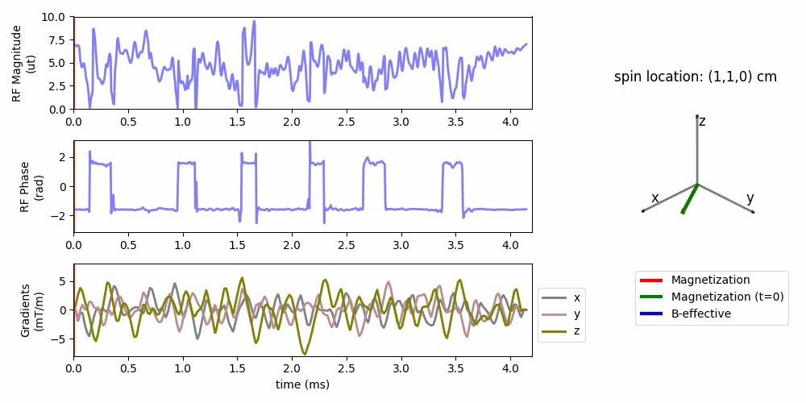

**Publications**
- **J Yang**, JF Nielsen, JA Fessler, and Y Jiang, "Multi‐Dimensional RF Pulse Design Using Auto‐Differentiable Spin‐Domain Optimization and its Application to Reduced Field‐of‐View Imaging", Magn Reson Med, 2025. ([paper](https://doi.org/10.1002/mrm.30607) / [code](https://github.com/MIITT-MRI-Jianglab/Multid_RF_SpinDomain))   

**Conference and presentations**
- **J Yang**, JF Nielsen, JA Fessler, and Y Jiang, "3D High-Resolution Reduced Field-of-View Imaging by Combining EPI and Spatially Selective Pulses", oral presentation in Magnetic Resonance in Madison, Madison, WI. (July 2025) 
- **J Yang**, JF Nielsen, JA Fessler, and Y Jiang, “3D High-Resolution Reduced Field-of-View T2-Weighted Imaging by Combining 3D EPI and Spatially Selective Pulses”, digital poster in 2025 ISMRM Annual Meeting, Honolulu, Hawaii. (Annual Meeting Program Committee (AMPC) selected transitional poster! Summa Cum Laude Award!)
- **J Yang**, JF Nielsen, and Y Jiang, “Safer Non-Cartesian Gradients for Your Subject and Scanner”, digital poster in 2025 ISMRM Annual Meeting, Honolulu, Hawaii.
- **J Yang**, JF Nielsen, JA Fessler, and Y Jiang, “3D High-Resolution Reduced Field-of-View T2-Weighted Prostate Imaging by Combining 3D EPI & Spatially Selective Pulses”, digital poster in 2025 ISMRM Workshop on Body MRI: Unsolved Problems & Unmet Needs, Philadelphia, PA, USA
- **J Yang**, JE Fajardo, JA Fessler, V Gulani, JF Nielsen, and Y Jiang, “Calibration-free Multidimensional Universal Refocusing Pulse Design for 3D Reduced Field-of-View Prostate Imaging”, digital poster in 2024 ISMRM Annual Meeting, Singapore. (May 2024) (program number: 4094)
- JE Fajardo, **J Yang**, T Kaur, N Seiberlich, V Gulani, Y Jiang, “Accelerated MR Fingerprinting with 1 mm spatial resolution for prostate cancer at 3.0 T”, 2024 ISMRM Annual Meeting, Singapore.
- **J Yang**, JF Nielsen, and Y Jiang, “Multidimensional RF pulse design in spin-domain using auto-differentiation for 3D refocusing pulse”, in-person oral Power Pitch presentation in 2023 ISMRM Annual Meeting, Toronto, ON, Canada. (June 2023) (program number: 0200)
- **J Yang**, JF Nielsen, and Y Jiang, “Multidimensional RF pulse design in spin-domain using auto-differentiation”, poster in 2023 ISMRM Workshop on Data Sampling & Image Reconstruction, Sedona, AZ, USA. (poster number: 77)

**Posts**
- [some resources and notes of MRI](filesJiayao/mri-notes.md)
- [notes on mri pulses](filesJiayao/noteMRIpulses/note-mri-pulses.md)
- [More about me ...](filesJiayao/aboutme.md)

[About me](files/aboutme.md)

*<small>last update: 02/15/2026</small>* 
[*<small>About this site which is based on ...</small>*](about.md)

...
